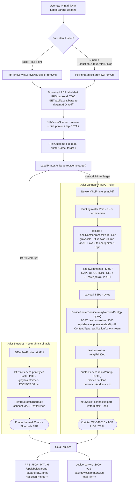

# Label Print Flow

Alur cetak label (contoh: label barang dagang) dari tablet ke printer. Ada dua
jalur transport: **Bluetooth** (langsung dari tablet, ESC/POS 80mm) dan
**Jaringan / TSPL** (lewat relay `device-service` ke printer TCP port 9100).

## Files

- Diagram source (sequence): [label-print.mmd](./label-print.mmd)

## Ringkasan

1. User tap Print di layar list label → `PdfPrintService.previewMultipleFromUrls`
   (bulk) atau `previewFromUrl` (1 label).
2. Tablet download PDF label dari PPS backend
   (`GET /api/labels/barang-dagang/:noBarangDagang/pdf/`).
3. `PdfViewerScreen` menampilkan preview, user memilih printer & tap CETAK →
   mengembalikan `PrintOutcome` berisi `PrinterTarget`.
4. `LabelPrinter.forTarget(outcome.target)` memilih implementasi:
   - `BtPrinterTarget` → `BtEscPosPrinter` → `BtPrintService.printBytes`
     (raster → grayscale/dither → ESC/POS) → `PrintBluetoothThermal` (SPP).
   - `NetworkPrinterTarget` → `NetworkTsplPrinter.printPdf`.
5. **Jalur jaringan** (`NetworkTsplPrinter`):
   - `Printing.raster` PDF → PNG per halaman.
   - Isolate: `LabelRaster.processPageFixed` — grayscale → fit ke kanvas ukuran
     label → Floyd–Steinberg dither → 1 bpp.
   - `_pageCommands` → perintah TSPL `SIZE`/`GAP`/`DIRECTION`/`CLS`/`BITMAP`/`PRINT`.
   - `DevicePrinterService.relayNetworkPrint(ip, bytes)` →
     `POST /api/devices/printers/relay?ip=<ip>` body = payload TSPL mentah
     (`application/octet-stream`).
   - `device-service` (`relayPrintJob` → `printerService.relayPrint`): cari printer
     NETWORK by `network.ipAddress`, buka `net.Socket` ke `ip:port`, `write(buffer)`,
     `end`. Balas `{ ok, bytesSent, latencyMs }`.
6. Setelah sukses, dua pencatatan:
   - PPS backend: `PATCH /api/labels/barang-dagang/:noBarangDagang/print`
     → `HasBeenPrinted++` (via `markItemPrinted` di repository).
   - device-service: `POST /api/devices/printers/log` → `totalPrint++`.

## Catatan

- Konversi PDF → gambar → TSPL **seluruhnya di tablet**. `device-service` hanya
  pipa TCP tipis (terima `Buffer`, `socket.write` ke printer).
- Bulk print mengirim **1 POST relay per label** (loop `printer.printPdf(bytes)`),
  bukan satu payload gabungan.
- Jalur jaringan **tanpa fallback**: jika `device-service` mati / tak terjangkau,
  cetak jaringan gagal. Bluetooth tidak terpengaruh.
- Prasyarat jaringan: host `device-service` harus bisa TCP ke `printer:9100`
  (masalah VLAN/firewall pernah terjadi — lihat memori project).

## Flowchart (kedua jalur)

